## Escuela Colombiana de Ingeniería
### Arquitecturas de Software – ARSW


#### Ejercicio – programación concurrente, condiciones de carrera y sincronización de hilos. EJERCICIO INDIVIDUAL O EN PAREJAS.

##### Parte I – Antes de terminar la clase.

Control de hilos con wait/notify. Productor/consumidor.

1. Revise el funcionamiento del programa y ejecútelo. Mientras esto ocurren, ejecute jVisualVM y revise el consumo de CPU del proceso correspondiente. A qué se debe este consumo?, cual es la clase responsable?

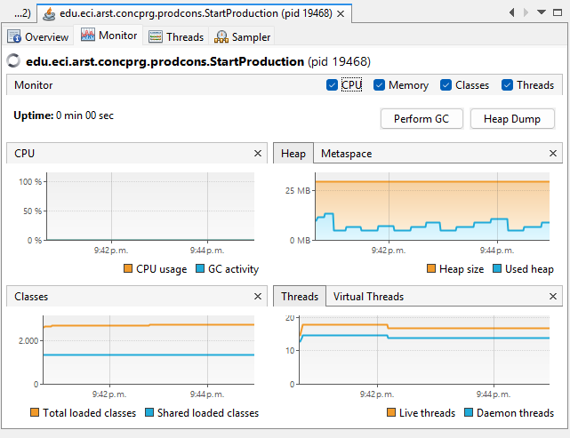

Al ejecutar la aplicación y revisarla con jVisualVM, se observa que uno de
los hilos (Thread-1, correspondiente a Consumer) se mantiene en estado
"Running" el 100% del tiempo, mientras que el hilo del Producer (Thread-0)
pasa la mayor parte del tiempo en "Wait".

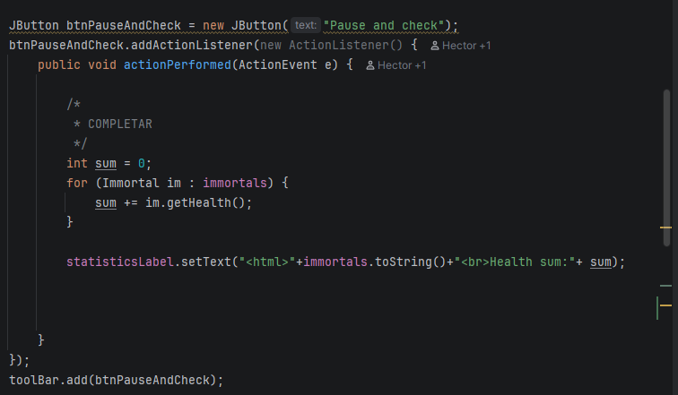

Esto se debe a que Consumer.run() implementa un ciclo while(true) que
consulta continuamente el tamaño de la cola (queue.size() > 0) sin ningún
mecanismo de espera o bloqueo. Cuando la cola está vacía, el hilo sigue
iterando sin detenerse, generando espera activa (busy-waiting) y
manteniendo un núcleo de CPU ocupado permanentemente. La clase
responsable de este consumo es Consumer.

2. Haga los ajustes necesarios para que la solución use más eficientemente la CPU, teniendo en cuenta que -por ahora- la producción es lenta y el consumo es rápido. Verifique con JVisualVM que el consumo de CPU se reduzca.

Se modificaron Consumer y Producer para sincronizar el acceso a la cola
compartida usando wait()/notify() en lugar de espera activa: cuando no
hay elementos que consumir (o se llegó al límite de stock), el hilo
correspondiente se suspende con wait() en vez de seguir preguntando en
un ciclo sin parar. Cada vez que se agrega o se retira un elemento, se
notifica al otro hilo con notifyAll().

Al revisar nuevamente con jVisualVM se observa que el uso de CPU se
mantiene en 0% de forma sostenida (antes se mantenía cerca del 100%
por la espera activa del Consumer original).

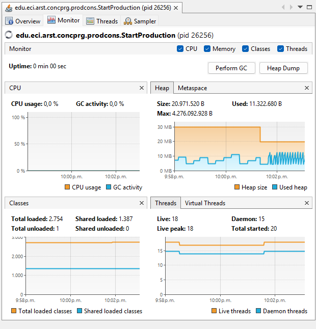

Adicionalmente, en la pestaña Threads, tanto Thread-0 (Producer) como
Thread-1 (Consumer) muestran 0% de tiempo "Running": ambos hilos pasan
prácticamente todo el tiempo suspendidos (Wait) y solo se activan
brevemente cuando hay un elemento que producir o consumir.


Esto confirma que el consumo de CPU se redujo de manera significativa
respecto a la versión original.

3. Haga que ahora el productor produzca muy rápido, y el consumidor consuma lento. Teniendo en cuenta que el productor conoce un límite de Stock (cuantos elementos debería tener, a lo sumo en la cola), haga que dicho límite se respete. Revise el API de la colección usada como cola para ver cómo garantizar que dicho límite no se supere. Verifique que, al poner un límite pequeño para el 'stock', no haya consumo alto de CPU ni errores.

Se probó el escenario de producción rápida y consumo lento (Producer con
sleep de 50ms, Consumer con sleep de 1000ms), manteniendo el límite de
stock (STOCK_LIMIT = 10) implementado con wait()/notify(): cuando la cola
alcanza el límite, el Producer se suspende hasta que el Consumer libera
espacio, en lugar de seguir agregando elementos sin control.

En la consola se observó que, una vez alcanzado el límite, el Producer
deja de agregar elementos y retoma la producción solo cuando el Consumer
consume uno (patrón 1 a 1), sin que la cola supere el tamaño configurado
ni se presenten errores o excepciones.

Al revisar con jVisualVM, el uso de CPU se mantuvo en 0% durante toda la
prueba, y ambos hilos (Thread-0 y Thread-1) permanecieron la mayor parte
del tiempo en estado de espera, sin actividad continua.


Esto confirma que, incluso con un productor mucho más rápido que el
consumidor, el límite de stock se respeta sin generar consumo alto de
CPU ni errores.

##### Parte II. – Antes de terminar la clase.

Teniendo en cuenta los conceptos vistos de condición de carrera y sincronización, haga una nueva versión -más eficiente- del ejercicio anterior (el buscador de listas negras). En la versión actual, cada hilo se encarga de revisar el host en la totalidad del subconjunto de servidores que le corresponde, de manera que en conjunto se están explorando la totalidad de servidores. Teniendo esto en cuenta, haga que:

- La búsqueda distribuida se detenga (deje de buscar en las listas negras restantes) y retorne la respuesta apenas, en su conjunto, los hilos hayan detectado el número de ocurrencias requerido que determina si un host es confiable o no (_BLACK_LIST_ALARM_COUNT_).
- Lo anterior, garantizando que no se den condiciones de carrera.

Se implementó la clase BlackListSearchThread, que revisa un segmento del
total de servidores. El método checkHost(ipaddress, n) reparte el espacio
de búsqueda entre n hilos y usa join() para esperar a que todos terminen
antes de calcular el resultado final.

Para lograr que la búsqueda se detenga apenas se alcanza el número de
ocurrencias requerido (BLACK_LIST_ALARM_COUNT), sin condiciones de carrera,
se usó:
- Un AtomicBoolean compartido (alarmReached) que cada hilo revisa antes de
  seguir con el siguiente servidor de su segmento.
- Un bloque synchronized al momento de agregar una ocurrencia encontrada:
  verifica el conteo actual, agrega el resultado e incrementa el contador
  compartido como una sola operación atómica, evitando que dos hilos
  agreguen resultados de más una vez alcanzado el límite.

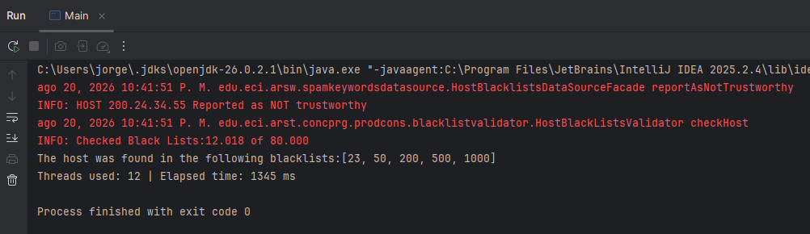

Como se observa en la consola, con 12 hilos solo se revisaron 12.018 de
los 80.000 servidores antes de detenerse, encontrando correctamente las 5
ocurrencias esperadas ([23, 50, 200, 500, 1000]) y reportando el host como
NOT trustworthy, sin necesidad de recorrer el resto de las listas negras.

##### Parte III. – Avance para el martes, antes de clase.

Sincronización y Dead-Locks.


1. Revise el programa “highlander-simulator”, dispuesto en el paquete edu.eci.arsw.highlandersim. Este es un juego en el que:

	* Se tienen N jugadores inmortales.
	* Cada jugador conoce a los N-1 jugador restantes.
	* Cada jugador, permanentemente, ataca a algún otro inmortal. El que primero ataca le resta M puntos de vida a su contrincante, y aumenta en esta misma cantidad sus propios puntos de vida.
	* El juego podría nunca tener un único ganador. Lo más probable es que al final sólo queden dos, peleando indefinidamente quitando y sumando puntos de vida.


2. Revise el código e identifique cómo se implemento la funcionalidad antes indicada. 
   Dada la intención del juego, un invariante debería ser que la sumatoria de los puntos de vida de todos los jugadores siempre sea el mismo(claro está, en un instante de tiempo en el que no esté en proceso una operación de incremento/reducción de tiempo). Para este caso, para N jugadores, cual debería ser este valor?.


	R/ El logica de la funcionalidad es que cada jugador recupera vida deacuerdo ala vida que le quita al otro jugador,
	y deacuardo a lo que deberia pasar el jugador tendria que curarse mucho menos de lo que hace daño , para que este no entre en un ciclo de invensibilidad en el cual ninguno de los jugadores se puedan matar.
    ahora dado que cada operación fight preserva la vida total y no añade ni destruye puntos de salud, el valor que la sumatoria debe mantener en todo momento es:

--
	$$\text{Invariante} = N \times\text{DEFAULT HEALTH}$$


3. Ejecute la aplicación y verifique cómo funcionan las opciones ‘pause and check’. Se cumple el invariante?.

	
	
	R/ En este caso la funcionalidad no esta completa , por lo cual el boton ‘pause and check’ actualmente solo muestra la informacion de la vida y de los jugadores en una parte de la aplicacion,
	sin llegar a detener la ejecucion del codigo.


4. Una primera hipótesis para que se presente la condición de carrera para dicha función (pause and check), es que el programa consulta la lista cuyos valores va a imprimir, a la vez que otros hilos modifican sus valores. Para corregir esto, haga lo que sea necesario para que efectivamente, antes de imprimir los resultados actuales, se pausen todos los demás hilos. Adicionalmente, implemente la opción ‘resume’.

   

   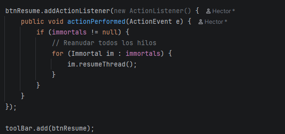

5. Verifique nuevamente el funcionamiento (haga clic muchas veces en el botón). Se cumple o no el invariante?.

R/ Al hacer clic muchas veces seguidas en el botón Pause and check, no se cumple el invariante (la suma total de salud cambia o varia).

6. Identifique posibles regiones críticas en lo que respecta a la pelea de los inmortales. Implemente una estrategia de bloqueo que evite las condiciones de carrera. Recuerde que si usted requiere usar dos o más ‘locks’ simultáneamente, puede usar bloques sincronizados anidados:

	```java
	synchronized(locka){
		synchronized(lockb){
			…
		}
	}
	```
 
    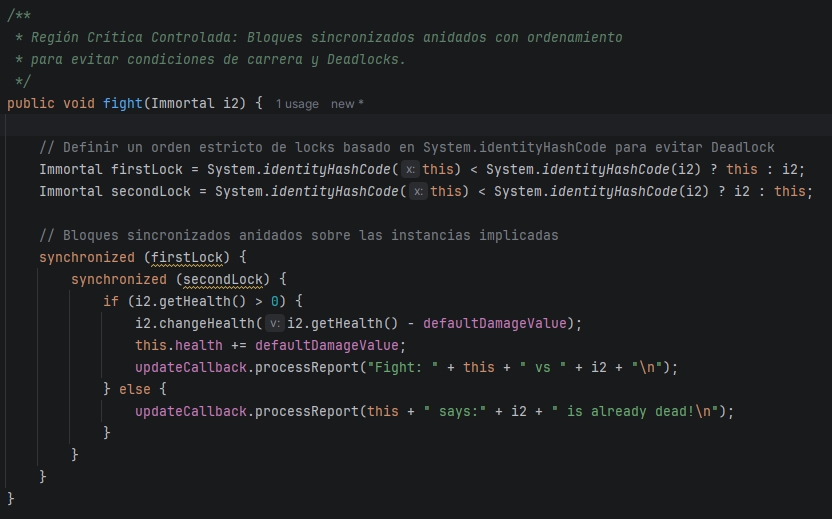


7. Tras implementar su estrategia, ponga a correr su programa, y ponga atención a si éste se llega a detener. Si es así, use los programas jps y jstack para identificar por qué el programa se detuvo.

	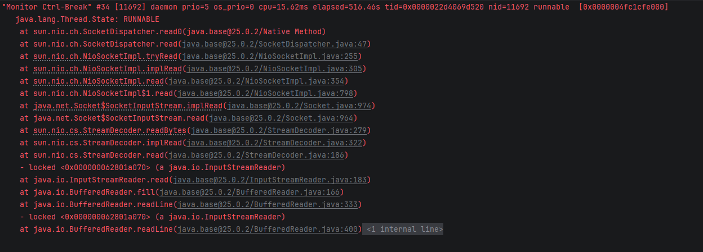

	R/ Ala hora de hacer un jps y un jstack pero con la herramienta de intelJ nos pudimos dar cuenta que el programa no llegaba a detenerse

   8. Plantee una estrategia para corregir el problema antes identificado (puede revisar de nuevo las páginas 206 y 207 de _Java Concurrency in Practice_). 
   
   R/ Estrategia de Solución: Ordenamiento por System.identityHashCode:
   Para ordenar dos objetos cualesquiera de la misma clase sin riesgo de colisión ni dependencia de nombres, se utiliza System.identityHashCode(Object).

9. Una vez corregido el problema, rectifique que el programa siga funcionando de manera consistente cuando se ejecutan 100, 1000 o 10000 inmortales. Si en estos casos grandes se empieza a incumplir de nuevo el invariante, debe analizar lo realizado en el paso 4.
	
	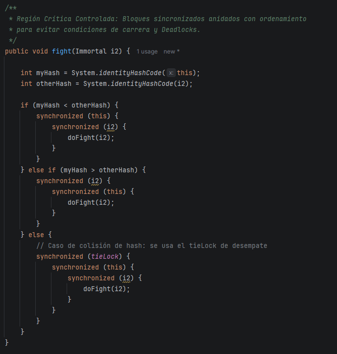

    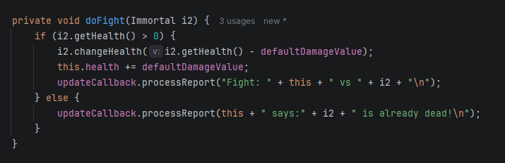
	
	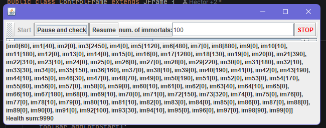

	R/ El problema funciona bien hasta los 100 casos despues de los 1000 el programa se queda sin memoria

10. Un elemento molesto para la simulación es que en cierto punto de la misma hay pocos 'inmortales' vivos realizando peleas fallidas con 'inmortales' ya muertos. Es necesario ir suprimiendo los inmortales muertos de la simulación a medida que van muriendo. Para esto:

	* Analizando el esquema de funcionamiento de la simulación, esto podría crear una condición de carrera? Implemente la funcionalidad, ejecute la simulación y observe qué problema se presenta cuando hay muchos 'inmortales' en la misma. Escriba sus conclusiones al respecto en el archivo RESPUESTAS.txt.
	* Corrija el problema anterior __SIN hacer uso de sincronización__, pues volver secuencial el acceso a la lista compartida de inmortales haría extremadamente lenta la simulación.

11. Para finalizar, implemente la opción STOP.

	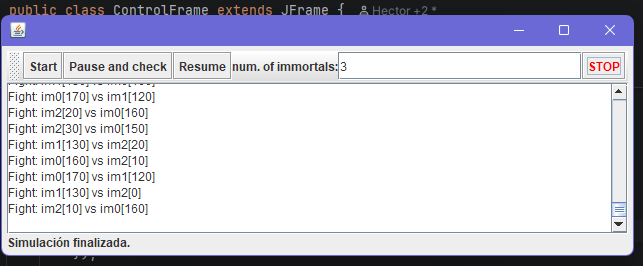

<!--
### Criterios de evaluación

1. Parte I.
	* Funcional: La simulación de producción/consumidor se ejecuta eficientemente (sin esperas activas).

2. Parte II. (Retomando el laboratorio 1)
	* Se modificó el ejercicio anterior para que los hilos llevaran conjuntamente (compartido) el número de ocurrencias encontradas, y se finalizaran y retornaran el valor en cuanto dicho número de ocurrencias fuera el esperado.
	* Se garantiza que no se den condiciones de carrera modificando el acceso concurrente al valor compartido (número de ocurrencias).


2. Parte III.
	* Diseño:
		- Coordinación de hilos:
			* Para pausar la pelea, se debe lograr que el hilo principal induzca a los otros a que se suspendan a sí mismos. Se debe también tener en cuenta que sólo se debe mostrar la sumatoria de los puntos de vida cuando se asegure que todos los hilos han sido suspendidos.
			* Si para lo anterior se recorre a todo el conjunto de hilos para ver su estado, se evalúa como R, por ser muy ineficiente.
			* Si para lo anterior los hilos manipulan un contador concurrentemente, pero lo hacen sin tener en cuenta que el incremento de un contador no es una operación atómica -es decir, que puede causar una condición de carrera- , se evalúa como R. En este caso se debería sincronizar el acceso, o usar tipos atómicos como AtomicInteger).

		- Consistencia ante la concurrencia
			* Para garantizar la consistencia en la pelea entre dos inmortales, se debe sincronizar el acceso a cualquier otra pelea que involucre a uno, al otro, o a los dos simultáneamente:
			* En los bloques anidados de sincronización requeridos para lo anterior, se debe garantizar que si los mismos locks son usados en dos peleas simultánemante, éstos será usados en el mismo orden para evitar deadlocks.
			* En caso de sincronizar el acceso a la pelea con un LOCK común, se evaluará como M, pues esto hace secuencial todas las peleas.
			* La lista de inmortales debe reducirse en la medida que éstos mueran, pero esta operación debe realizarse SIN sincronización, sino haciendo uso de una colección concurrente (no bloqueante).

	

	* Funcionalidad:
		* Se cumple con el invariante al usar la aplicación con 10, 100 o 1000 hilos.
		* La aplicación puede reanudar y finalizar(stop) su ejecución.
		
		-->

<a rel="license" href="http://creativecommons.org/licenses/by-nc/4.0/"></a><br />Este contenido hace parte del curso Arquitecturas de Software del programa de Ingeniería de Sistemas de la Escuela Colombiana de Ingeniería, y está licenciado como <a rel="license" href="http://creativecommons.org/licenses/by-nc/4.0/">Creative Commons Attribution-NonCommercial 4.0 International License</a>.
